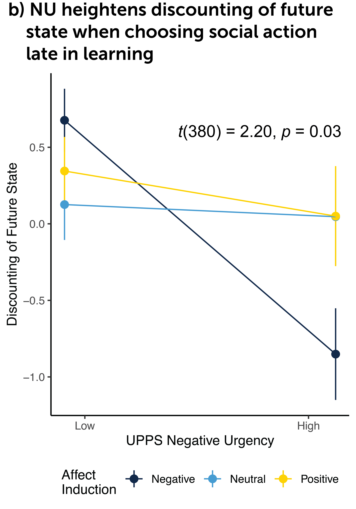

```{r setup, include=FALSE}
knitr::opts_chunk$set(echo = TRUE)
```

```{r, out.width = "1000px", echo = FALSE}

knitr::include_graphics("Fig1.png")
```


Proposed model of affect-based impulsivity. A stressor induces negative affect. Increases in negative affect elicits concomitant changes in circulating levels of norepinephrine and glucocorticoids. GCs enhance DA reativity in NAcc shell and NE + GCs blunt mPFC functioning. Altered functioning in mPFC and NAcc shell result in altered balance of Pavlovian and goal-directed decision systems. Heightened influence of Pavlovian systems on decision-making resulted in heightened influence of reward cues and invigorate pursuit of rewards. 


```{r, out.width = "400px", echo = FALSE}


```


A community sample of 386 adults completed a task assessing impulsivity following an affect induction. In support of our behavioral hypotheses, among participants exposed to the negative affect induction, self-reported negative urgency heightened discounting of future state when choosing a social action late in learning, β = 0.41, t(380) = 2.20, p = 0.029.
